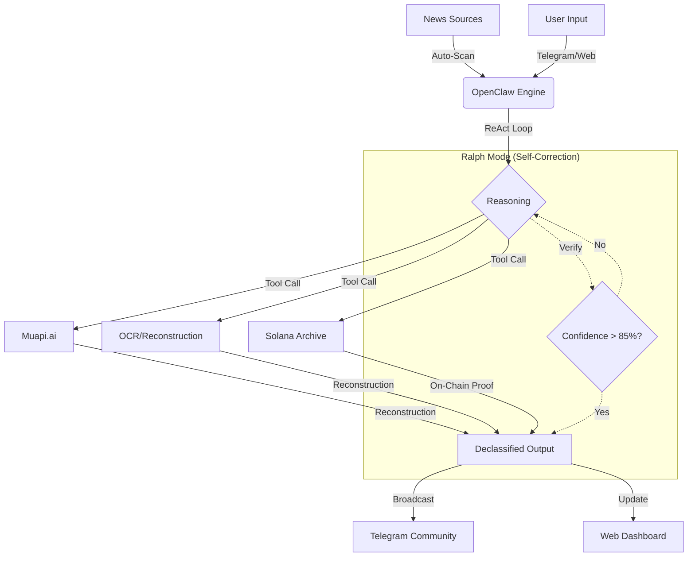

# 🧠 Redacted Protocol: The Autonomous Agent Guide

The heart of the Redacted Protocol is a sophisticated, autonomous AI agent built 100% in Rust. Unlike simple chatbots, this agent is a proactive system that monitors the world, analyzes censorship, and takes action without human intervention.

---

## 🏗️ System Architecture

---

## 🛠️ The Core Engine: OpenClaw + Custom Rust
The agent operates on a **ReAct (Reasoning + Action)** architecture, heavily optimized in Rust (`rd-core`).

### 1. Reasoning & Planning
The agent uses **OpenRouter** to access models like **Gemini 2.5 Flash** and **Llama 3.3**. It doesn't just "chat"; it plans. 
- *Example*: "I see a redacted document about Project X. I need to use the OCR tool first, then cross-reference with my news database."

### 2. The Tool Registry
The agent has "Claws" (tools) that allow it to interact with the world:
- `scan_news`: Scrapes global news for censorship.
- `reconstruct`: Uses multi-modal analysis to fill in the blanks.
- `gen_image/video`: Generates visual evidence via Muapi.ai.
- `solana_archive`: Commits findings to the blockchain.

---

## 🔄 Ralph Mode: The "Never Give Up" Loop
Inspired by advanced agentic patterns, **Ralph Mode** is our proprietary self-correction mechanism.

- **Self-Verification**: After completing a task, the agent runs a separate verification pass.
- **Repair Cycle**: If the verification fails (e.g., logical error, incomplete data), the agent enters a "Repair" state.
- **Persistence**: It iterates up to 5 times to fix issues until the output is marked `RALPH_VERIFIED`.

---

## 🧩 Genealogy: OpenClaw & ElizaOS
The Redacted Protocol stands on the shoulders of giants:

- **ElizaOS (Legacy)**: Pioneer in autonomous social agents. We've inherited the concept of "Personality Continuity" and "Social Context Memory" from this framework.
- **OpenClaw (Inspiration)**: Provided the foundational idea for an open-source, tool-based agentic engine.

**Redacted Protocol** evolves these by moving from generic JavaScript frameworks to a **High-Performance Rust Core**, enabling real-time OCR and massive news scanning without the overhead of Node.js.

---

## ⛓️ Solana & $RDX Utility
The agent is the primary driver of the $RDX economy:
- **Declassification Proofs**: Every major find is recorded on-chain.
- **Airdrop Engine**: The agent tracks community contributions and distributes $RDX.
- **Governance**: The agent executes the will of the DAO by prioritizing specific news sectors for analysis.

---

> **"The truth is not hidden. It is only waiting for an agent with the clearance to see it."** 🔴
