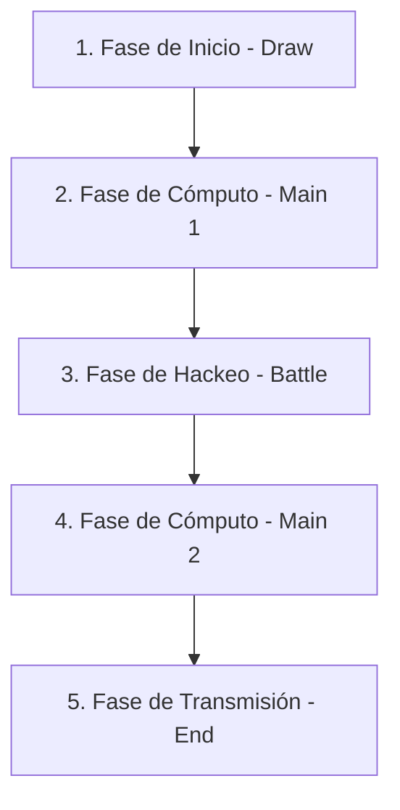

# REDACTED: Archivo 0 — Manual de Reglas y Protocolo de Duelo

Este manual establece las reglas del TCG híbrido **REDACTED: Archivo 0**.

---

## 1. Construcción de Mazos y Preparación

### El Mazo Principal:
- Debe contener exactamente **40 cartas**.
- Puede incluir un máximo de **3 copias** de cualquier carta por su ID.
- Formado por:
  - **Grupos (Monstruos):** Nodos activos de poder y defensa.
  - **Plots (Hechizos):** Acciones de uso inmediato o soporte.
  - **Firewalls (Trampas):** Defensas y contramedidas que se juegan boca abajo.

### La Bóveda (Mazo Extra):
- Hasta **15 cartas** de Entidades Superiores o Agentes del Merge.

### Inicio del Duelo:
- Cada duelista comienza con **8,000 Puntos de Integridad de Red (PIR)**.
- Ambos jugadores barajan sus mazos y roban **5 cartas** iniciales.

---

## 2. Las Fases del Turno

Cada turno se divide en 5 fases obligatorias:

### 1. Fase de Inicio (Draw Phase)
El jugador activo roba 1 carta de su mazo principal.

### 2. Fase de Cómputo 1 (Main Phase 1)
- Invocar Nodos (Grupos): Puedes invocar un Grupo de tu mano a tu zona de Servidores.
- Encriptar Grupos/Firewalls: Puedes colocar cartas de tu mano boca abajo (Encriptadas) en la fila trasera de puertos o como defensas de servidor.
- Jugar Plots: Activar cartas de acción desde la mano.

### 3. Fase de Hackeo (Battle Phase)
El jugador declara ataques de hackeo usando sus Grupos activos contra los del rival:
- **Ataque a Nodo Desclasificado (Boca Arriba):** El atacante compara su PWR contra el PWR/RES del defensor. Si el PWR del atacante es mayor, el nodo defensor es destruido (enviado al Archivo de Descarte) y el rival sufre la diferencia como daño a sus PIR.
- **Ataque a Nodo Encriptado (Boca Abajo):** Cuando declaras un ataque contra un nodo encriptado, este se **revela**. Si resulta ser un nodo de defensa de alta resistencia, puedes sufrir daño de retroalimentación de red.
- **Ataque Directo:** Si el rival no tiene Grupos defendiendo sus Servidores, tus Grupos pueden atacar directamente a su red. El oponente sufre daño de integridad igual al PWR de tu Grupo atacante.

### 4. Fase de Cómputo 2 (Main Phase 2)
Puedes colocar más Firewalls o Plots para preparar tu defensa durante el turno del oponente.

### 5. Fase de Transmisión (End Phase)
Se comprueban condiciones de victoria especial y se descarta hasta tener un máximo de 5 cartas en la mano.

---

## 3. La Cadena de Criptografía (Chain Protocol)

Cuando activas un Plot o desencriptas un nodo, tu oponente puede declarar una respuesta (Chain Link 2). Tú puedes responder a su respuesta (Chain Link 3).

### Ejemplo de Cadena:
- **Chain Link 1:** El Jugador A activa el Plot *Censura Total* para silenciar a un Agente enemigo.
- **Chain Link 2:** El Jugador B activa su Firewall encriptado *Acceso Denegado* para cancelar el efecto de *Censura Total*.
- **Chain Link 3:** El Jugador A activa su Firewall encriptado *Glitch Masivo* para desactivar los cortafuegos del Jugador B este turno.

### Resolución de la Cadena:
La cadena se resuelve de atrás hacia adelante (**LIFO - Last In, First Out**):
1. **Chain Link 3 (Glitch Masivo):** Inhabilita el firewall del Jugador B.
2. **Chain Link 2 (Acceso Denegado):** Es cancelado por el efecto de *Glitch Masivo*.
3. **Chain Link 1 (Censura Total):** Se ejecuta con éxito y silencia al Agente del Jugador B.
